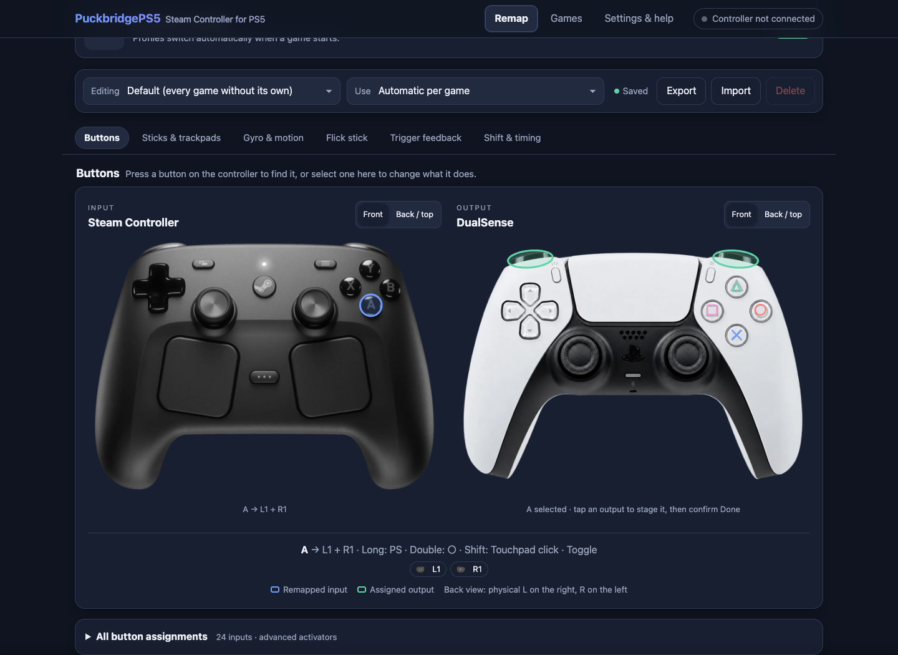
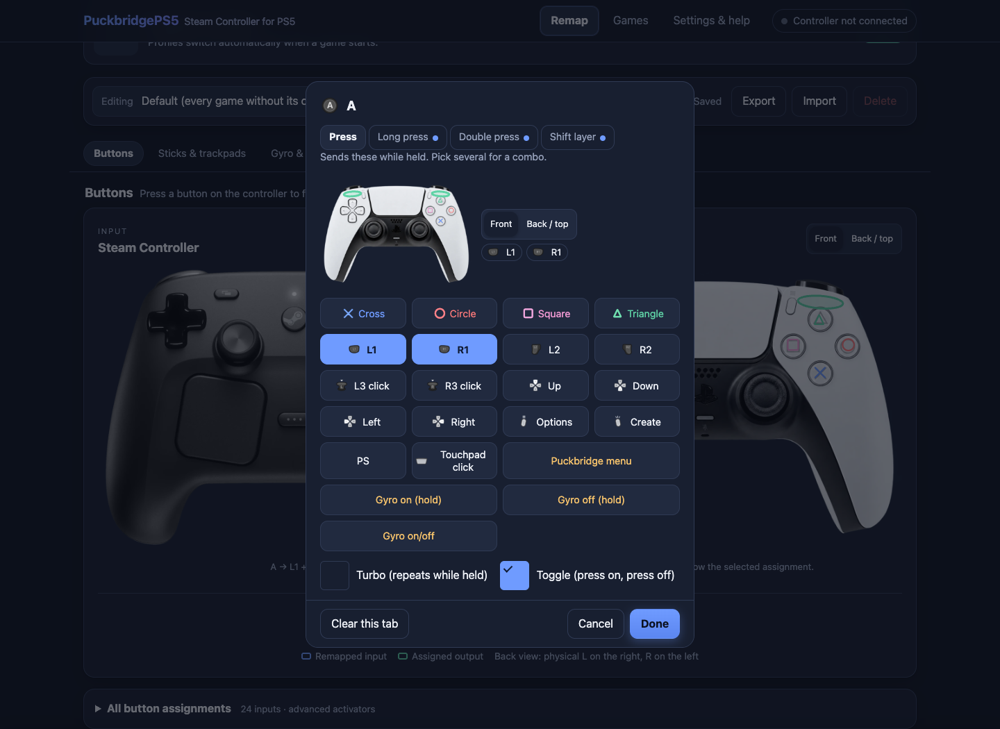

<div align="center">

# SteamController-PS5

**Steam Controller 2026 → virtual DualSense on PS5**<br>
USB-C & Valve Puck · visual remapping · gyro · trackpads · haptics

[Download 1.0.0 Experimental](https://github.com/MNeroba/SteamController-PS5/releases/tag/dev/v1.0.0-experimental) · [Get started](docs/development/LOADING.md) · [Build](docs/BUILDING.md) · [Changelog](CHANGELOG.md) · [Contribute](CONTRIBUTING.md)

[](https://github.com/MNeroba/SteamController-PS5/actions/workflows/host-tests.yml)
[](https://github.com/MNeroba/SteamController-PS5/actions/workflows/ps5-cross-build.yml)



</div>

> **Experimental prerelease.** Host tests and SDK builds pass; this release has **no maintainer-run physical PS5 acceptance result**. FW **13.60** is the intended, unverified test target. A stock console cannot load this ELF. Use an independently confirmed compatible development loader and keep your native DualSense available.

> **1.0.0 Experimental:** the consolidated public build. It includes the full dev.9 feature set, the neutral-gravity release-report fix, loopback `Host`-port validation, bounded icon reads, 404 for unknown routes, removal of the unused auth/peer modules and dead pairing routes, transient direct-HID retry, a three-second controller-link grace, and Media-tile registration by firmware NID with a post-success marker. Physical console behavior remains unverified.

> **External hardware evidence:** [TheBrokenG0d reports](https://github.com/MNeroba/SteamController-PS5/pull/8) WebUI and Puck input in system menus on one fat PS5/FW 13.20 at original PR source `c3a7ddb`. That build predates the revised filesystem adapter in dev.7; native DualSense coexistence and games were not systematically tested. It does not establish compatibility for this selected ELF or FW 13.60. Please [report reproducible results](.github/ISSUE_TEMPLATE/bug_report.yml) without tokens, account identifiers or serials.

**Controller transport:** [direct HID, rest/wake, safety limits and hardware test plan](docs/development/DEV8_CANDIDATE.md).

## Overview

One native ELF connects **one Steam Controller 2026** over USB-C or the official Valve Puck and translates its input into a virtual DualSense. The embedded WebUI lets you edit profiles and mappings without installing a separate web server or copying image assets.

The project builds on audited PuckbridgePS5 code. Steam-specific input stays in a reusable core; USB ownership, virtual-controller lifecycle and firmware-sensitive operations have separate responsibilities.

## Latest release — 1.0.0 Experimental

[Release notes and downloads](https://github.com/MNeroba/SteamController-PS5/releases/tag/dev/v1.0.0-experimental) · [Loading guide](docs/development/LOADING.md)

- **[Download the only ELF](https://github.com/MNeroba/SteamController-PS5/releases/download/dev/v1.0.0-experimental/SteamController-PS5-v1.0.0-experimental.elf)** — 2,069,488 bytes.
- **[SHA-256 file](https://github.com/MNeroba/SteamController-PS5/releases/download/dev/v1.0.0-experimental/SteamController-PS5-v1.0.0-experimental.elf.sha256)** — `3f2ed1f28122391bfda161db9d2221a645daa216993ae6c4edf1a44e69660c4c`.
- Payload Manager metadata, loading instructions, notices and license accompany the ELF.

Published 2026-11-18T22:27:39Z from [`f5208adb9608a589708f3f9d2f987ff0857e07bc`](https://github.com/MNeroba/SteamController-PS5/tree/f5208adb9608a589708f3f9d2f987ff0857e07bc) by [release workflow 44410095266](https://github.com/MNeroba/SteamController-PS5/actions/runs/44410095266). Seven assets contain one ELF; the downloaded digest, embedded source SHA/version and experimental warning were independently verified. The workflow repeats the normal host, ASan/UBSan, Chromium, SDK v0.43 and checksum gates. Physical PS5 acceptance remains outstanding.

## Features and verification

| Capability | Software evidence | PS5 hardware status |
| --- | --- | --- |
| USB-C and official Valve Puck | Checked device/interface selection, protocol parsing, transfer ownership and cleanup tests | Not tested |
| Virtual DualSense | Generation-aware lifecycle, default pending correlation, opt-in direct receipts with native/user checks, cleanup and logout/login regressions | Creation ABI, event ownership and user assignment unverified |
| Rest/wake recovery | Read-only power observation, owned cleanup, worker join and fresh-session consensus tests | Active-game suspend/resume and timing unverified |
| Buttons, sticks, triggers and four back buttons | Remapping, Shift, Long/Double press, Turbo/Toggle and profile tests | Gameplay unverified |
| Gyro, motion, trackpads and Flick Stick | Portable mapping, calibration and motion tests | Sensor orientation, feel and game behavior unverified |
| Haptics and trigger-effect translation | Feedback encoding, queue and ownership tests | Output routing and physical feedback unverified |
| Default/per-game profiles and visual editor | Atomic persistence, import/export and browser tests | Console storage and live integration unverified |
| Diagnostics | Loopback-only, bounded text export with filtered application logs | PS5/browser download unverified |
| Automatic Media tile | Embedded icon, ownership, first-run and installer-stub tests | Registration and launch unverified |

**Scope:** one active Steam Controller 2026, regular virtual DualSense. Native PS5 Bluetooth LE, Edge emulation, custom ShellUI controller identity and multiple active Steam Controllers remain research or unsupported. USB/Puck is independent of those research tracks. Haptic translation does not provide physical adaptive-trigger resistance.

[Detailed feature status](STEAM_CONTROLLER_2026.md) · [Hardware matrix](project-memory/HARDWARE_MATRIX.md) · [Test plan](docs/TEST_PLAN.md)

## Load and configure

The current 1.0.0 Experimental release is a single experimental ELF. Load it with an independently confirmed compatible loader. On first startup a background worker attempts to register **Steam Controller Settings** in PS5 Media; open that tile while the payload is running. It opens `http://127.0.0.1:8090/` without a pairing code. The WebUI is available only on the PS5, not from a PC, phone or LAN. Existing title paths are never overwritten automatically. If registration fails, consult the [loading guide](docs/development/LOADING.md) and use an existing PS5 browser to inspect the failure and retry.

Loopback Host and Origin checks protect browser requests. Other software running on the console with loopback access can control the WebUI. Registration, browser behavior and FW13.60 are physically unverified. The tile does not start the payload after a reboot. `ENABLE_WEBUI=0` disables both WebUI and its first-run tile attempt; hooks, bridge probing and DualSense handoff stay disabled by default.

### Troubleshooting

In **Settings & help → Diagnostics**, select **Download Diagnostic Report**. The report includes build identity, runtime firmware when available, startup stages, USB/virtual-controller state and a bounded filtered log tail. It remains useful with no controller connected.

Review the report before sharing it: profile names or USB paths may need further redaction. Never post credentials from older releases, console identifiers or bonding keys. Use the [bug-report template](https://github.com/MNeroba/SteamController-PS5/issues/new?template=bug_report.yml) for ordinary failures and [SECURITY.md](SECURITY.md) for vulnerabilities.

## Visual remapping

Select a Steam input, choose DualSense outputs, and stage changes before saving. Front/back views cover stick clicks, grip buttons and trackpad clicks. In the back view, physical **L is on the right**, **R on the left**.

| Back controls | Binding editor |
| --- | --- |
|  |  |

These screenshots come from the real **host fixture**, not a PS5 session; they illustrate remapping rather than current release Settings screens. [Editor behavior and verification →](docs/WEBUI_REMAP.md)

## Build from source

Requirements: Python 3, make, host Clang, **LLVM 18** and community **PS5 Payload SDK v0.43**. Node 24 and Playwright are needed only for browser checks. No proprietary Sony SDK is used.

```sh
git clone https://github.com/MNeroba/SteamController-PS5.git
cd SteamController-PS5
# To rebuild the published version:
git checkout dev/v1.0.0-experimental
# Install the pinned SDK and export PS5_PAYLOAD_SDK/LLVM_CONFIG
# using docs/BUILDING.md, then:
make -C tests clean test
make -C tests sanitize
make -C payload clean
make -C payload
```

Output: `payload/ghost-control-ps5.elf` (retained internal filename). WebUI, controller images and optional tile assets are embedded automatically. Generated headers and build output are not committed. [Linux/macOS setup, browser checks and source identity →](docs/BUILDING.md)

## Project layout

```text
payload/          PS5 adapter, Steam core, USB, profiles, embedded WebUI
  web/            Browser UI, controller artwork and button prompts
  settings-tile/  Embedded optional launcher metadata and icon
config/payload/   Payload Manager metadata source
scripts/          Release, build and validation helpers
tests/            Portable C, fault-injection and browser regressions
docs/             Architecture, setup, evidence and release procedures
project-memory/   Current status, decisions and append-only test history
.github/          CI, release workflows and contribution templates
```

Transport owns I/O; the Steam decoder owns device details; mapping is independent of the PS5 ABI. Firmware-sensitive hooks are isolated. [Architecture →](docs/ARCHITECTURE.md)

## Progress and roadmap

- **Delivered:** audited foundation, host runtime hardening, reusable protocol/session/slot modules, mapping/profiles, embedded WebUI and the experimental release line through **1.0.0 Experimental**.
- **Next:** measure actual firmware and validate USB-C/Puck, native DualSense coexistence, user recovery, game input, motion/touch/feedback, storage and shutdown on a physical console.
- **Stable release:** blocked until the required hardware evidence matches the tested source. A passing SDK build does not establish firmware compatibility.
- **Research:** passive native BLE feasibility, stable cross-transport identity and advanced platform integration. Active stock-radio experiments require separate approval.

[Current status](project-memory/CURRENT_STATUS.md) · [Documentation index](docs/README.md) · [Changelog](CHANGELOG.md)

The [3 November runtime comparison](docs/development/UPSTREAM_RUNTIME_COMPARISON.md) reviews current analogs and SDK sources. The consolidated **1.0.0 Experimental** build includes bounded haptic-queue work, preserved Steam touch/pressure fields, opt-in direct HID, rest/wake handling and the hardening fixes listed above. Source/build evidence and remaining physical checks are documented separately.

## Contributing and security

External contributions use focused pull requests against `main`. Read [CONTRIBUTING.md](CONTRIBUTING.md), include a reproducible regression and actual checks, mark unavailable tests `NOT_RUN`, and record provenance before importing code or assets. Significant protocol, architecture or platform changes should be discussed in an issue first.

[Report a bug](https://github.com/MNeroba/SteamController-PS5/issues/new?template=bug_report.yml) · [Propose an improvement](https://github.com/MNeroba/SteamController-PS5/issues/new?template=feature_request.yml) · [Security policy](SECURITY.md)

## Credits and license

Thanks to the authors whose work made this project possible:

- **[PuckbridgePS5](https://github.com/ThisIsAkill/PuckbridgePS5)** — the audited implementation foundation, by ThisIsAkill.
- **[Ghostcontrol](https://github.com/srbraboo/Ghostcontrol-PS5-USB-Controller-Patcher)** and **[PoorDS4](https://github.com/ItsBlurf/PoorDS4)** — inherited PS5 integration and bridge work, credited to StonedModder and ItsBlurf.
- **[TheBrokenG0d / PR #8](https://github.com/MNeroba/SteamController-PS5/pull/8)** — PS5 hardware investigation, WebUI worker-stack and klog-backlog fixes.
- **[PS5 Payload SDK](https://github.com/ps5-payload-dev/sdk)** — community toolchain and API references.
- **[OmniPad-PS5](https://github.com/diegobarbosaa/OmniPad-PS5)** and **[LibrePadPS5](https://github.com/arwebSE/LibrePadPS5)** — reviewed engineering references; no implementation copied from these projects.
- **Xelu** — CC0 controller prompts; **Akhil Moola** — the inherited controller drawing credit. Protocol and platform references are listed with exact pins in [sources](docs/SOURCES_AND_EVIDENCE.md).

Code is **GPL-3.0-or-later**, with upstream notices retained. Supplied controller photos and the tile icon have owner-authorized publication terms; **no separate open artwork license was supplied**. The code license does not grant a new license for those assets. See [LICENSE](LICENSE), [provenance](docs/PROVENANCE.md), [controller artwork notice](payload/web/controllers/NOTICE.md), [tile artwork notice](payload/settings-tile/NOTICE.md) and [upstream documents](docs/archive/upstream/README.md).

Not affiliated with Valve or Sony. Steam, PlayStation and DualSense are their respective owners' trademarks.
